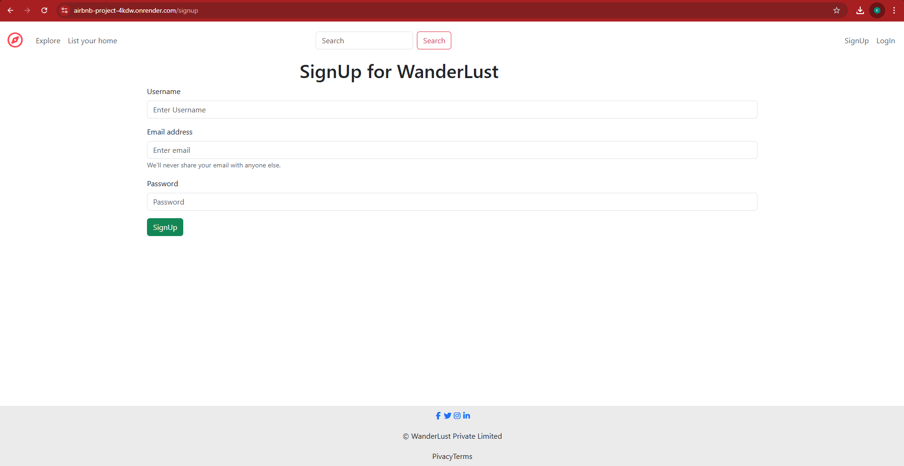
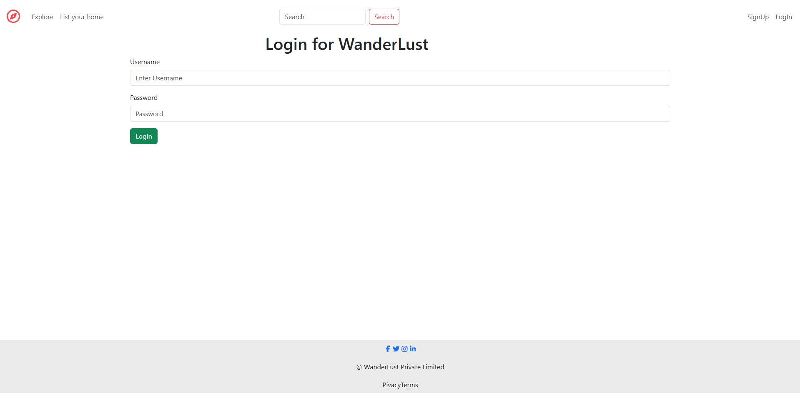
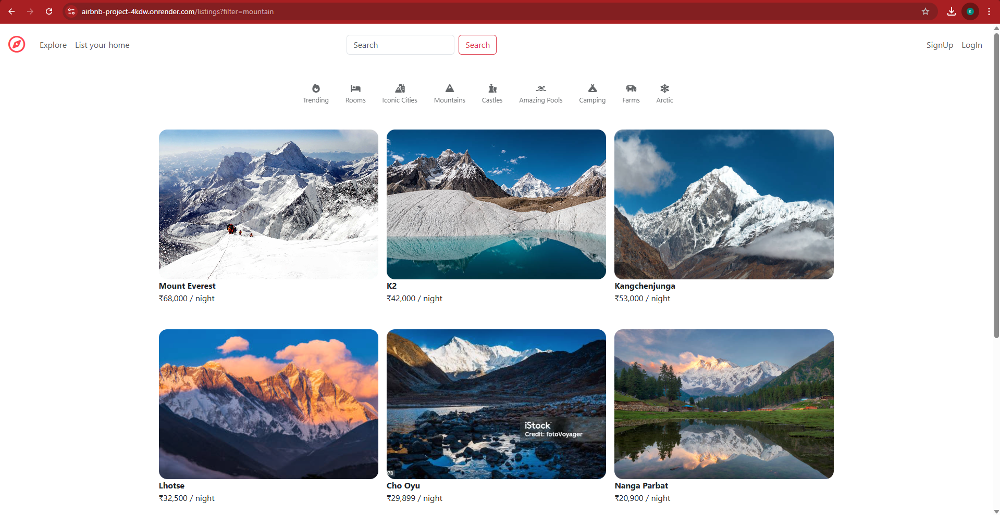
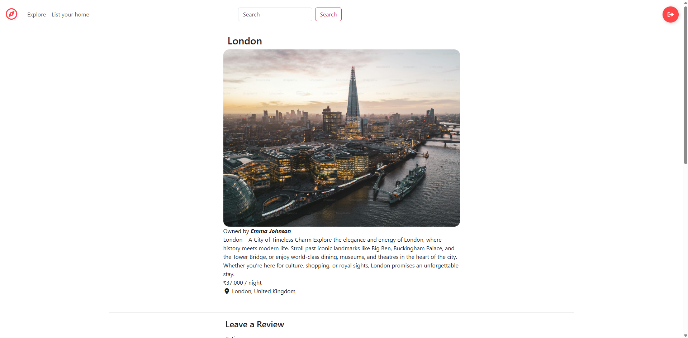
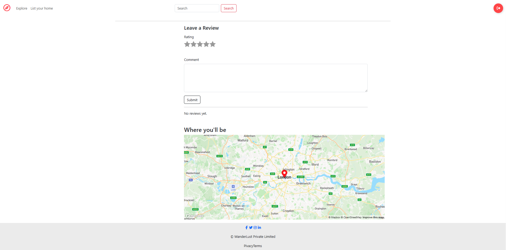
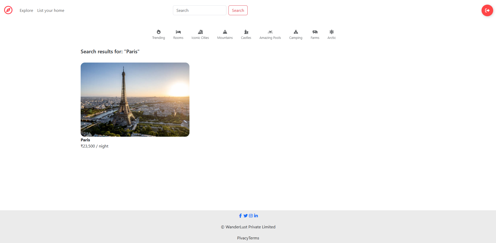

# 🏡 Airbnb Clone (MERN Stack - Without React)

[](https://nodejs.org/)
[](https://expressjs.com/)
[](https://www.mongodb.com/)
[](https://ejs.co/)
[](https://airbnb-project-4kdw.onrender.com/listings)
[](LICENSE)

---

## 🌐 Live Demo

🔗 **Hosted Link:** [Airbnb Project Live](https://airbnb-project-4kdw.onrender.com/listings)  
🔗 **GitHub Repository:** [View Source Code](https://github.com/Ayemen18/AIRBNB-Project)

---

## 📖 Overview

A full-stack **Airbnb Clone** built using **Node.js**, **Express**, **MongoDB**, and **EJS** (without React).  
It replicates Airbnb’s main functionalities such as user authentication, listing management, reviews, maps, and search.

This project demonstrates a full-featured backend and frontend integration using server-side rendering with EJS.

---

## 🧩 Tech Stack

| Layer | Technology |
|-------|-------------|
| **Frontend** | EJS, HTML5, CSS3, Bootstrap |
| **Backend** | Node.js, Express.js |
| **Database** | MongoDB with Mongoose |
| **Authentication** | Passport.js |
| **Cloud Storage** | Cloudinary |
| **Map Integration** | Mapbox API |
| **Hosting** | Render |

---

## ✨ Features

- 🏠 **Create, Edit & Delete Listings**  
- 👤 **User Authentication (Signup, Login, Logout)**  
- 💬 **Add & Delete Reviews**  
- 🗺️ **Map Integration** using Mapbox  
- 📸 **Image Uploads** via Cloudinary  
- 🔍 **Search Functionality** to find listings easily  
- 📱 **Responsive UI** using Bootstrap  
- ⚠️ **Error Handling & Validation** for form inputs  

---
## 📸 Screenshots

### SignUp Page


### Login Page


### Homepage


### Listing Details


### Map View


### Search



## ⚙️ Installation & Setup

Follow these steps to run the project locally 👇

### 1️⃣ Clone the Repository
```bash
git clone https://github.com/Ayemen18/AIRBNB-Project.git
cd AIRBNB-Project
```

### 2️⃣ Install Dependencies
```bash
npm install
```

### 3️⃣ Configure Environment Variables

Create a `.env` file in the root directory and add the following:

```
CLOUDINARY_CLOUD_NAME=your_cloud_name
CLOUDINARY_KEY=your_key
CLOUDINARY_SECRET=your_secret
MAPBOX_TOKEN=your_mapbox_token
MONGO_URL=your_mongodb_connection_string
SECRET=your_session_secret
```

> ⚠️ These environment variables are required for database connection, authentication, and third-party APIs.

### 4️⃣ Run the App
```bash
node app.js
```

Once started, your server will be running locally at port **8080**.

### 5️⃣ Open in Your Browser
Visit the app in your browser:
```
http://localhost:8080/listings
```

🎉 You’ll see the Airbnb Clone running on your local machine!

---

## 🧭 Folder Structure

```
AIRBNB-Project/
│
├── models/           # Mongoose Schemas (User, Listing, Review)
├── routes/           # Express Routes for Listings, Reviews, Authentication
├── views/            # EJS Templates (Frontend Pages)
├── public/           # Static Files (CSS, JS, Images)
├── utils/            # Helper Functions & Middleware
├── app.js            # Main Application File
├── package.json      # Project Dependencies & Scripts
├── .env.example      # Example Environment Variables
└── README.md         # Documentation
```

---

## 🧑‍💻 Author

👨‍💻 **Developed by [Shaik Ayemen](https://github.com/Ayemen18)**  
💡 A passionate full-stack developer focused on building scalable web applications and beautiful interfaces.

> ⭐ If you find this project helpful, don’t forget to star the repository!

---

## 💬 Acknowledgements

Huge thanks to the amazing tools and platforms that made this project possible:

- 🗺️ **[Mapbox](https://www.mapbox.com/)** — Map integration  
- ☁️ **[Cloudinary](https://cloudinary.com/)** — Image hosting and management  
- 💅 **[Bootstrap](https://getbootstrap.com/)** — Frontend styling  
- 🚀 **[Render](https://render.com/)** — Hosting service  
- 🍃 **[MongoDB Atlas](https://www.mongodb.com/atlas/database)** — Cloud database  
- 🔐 **[Passport.js](http://www.passportjs.org/)** — Authentication management  

---

## ✨ Quote

> “Build projects that inspire you — every great developer started with one simple idea.”  
> — *Shaik Ayemen*
